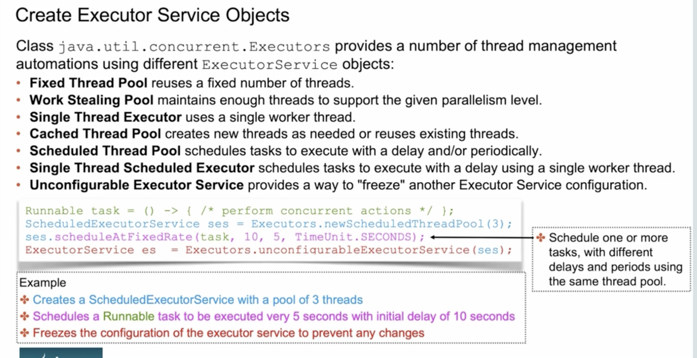

# Concurrency

- Thread is an execution path
- Thread actions are implementing using method run or Runnable
- Thread life cycle
  - new
  - runnable
  - blocked
  - waiting
  - timed waiting
  - terminated

- Thread Methods
  - start()
  - interrupt() => Set a flag of interrupted
  - isInterrupted() => Return if thread is interrupted
  - sleep(long milliseconds) throws InterruptedException
  - getName() => new Thread(r, "name")
  - getId() => Thread id
  - setDaemon() => By default is false (user thread). If set to true, the thread will terminate when there is no more user threads. Must be called before thread is started.
  - isDaemon()
  - join() It will join the two threads. So the main thread can only continue once the current thread finish
  - setPriority(int) => Values (1 to 10), default 5. Set how much CPU time it can get respect other threads.

Runnable => Interface that a thread can execute, with no return value.
Callable => Interface that a thread can execute, with return value.

## Interrupt Thread
- Interrupt: If the thread is sleep, it can receive and interrupt the signal, or it changes a flag in the thread, developer must check if "isInterrupted()" and terminate.
- start can not be called twice

## Block thread
Create a monitor object or class to coordinate access to some logic. Only one thread can access to the logic at one time, other threads are blocked.
- Using synchronized keyword
  - methods
  - Or inside the method

## Make thread wait
Using a monitor object is possible to make threads wait and forever.
- wait() => WAITING state
- wait(int time) => WAITING_TIME state
- notify() notifyAll()

In real to wake up the thread, it will go from WAITING => BLOCKED => RUNNABLE

## Executors
Utility class to create thread pools, with Scheduled or ExecutorService utility classes.
There are single thread pools, cached thread pools, there fixed rate creation of threads etc.

- shutdown() => Stop accepting new task.
- shutdownNow() => Stop executing threads. !!FIX
- boolean awaitingTermination(int time, TimeUnits) throws Exception => Waits for that time and checks if the executors has ended after shutdown
- void execute(Runnable) => Execute Runnable code, no waiting.
- Future submit(Callable) => Execute Callable code, wait for result with future.
- T invokeAny(List<Callable>) Throws Exception => Return the result of one that is complete.
- List<Future<T>> invokeAll(List<Callable>, int time ) => Returns the final results of all threads.

## ExecutorService

- scheduleAtFixedRate() => Creates a new task for the associated action at a set time interval, even if previous tasks for the same action are still active. In this manner, it is possible multiple threads working on the same action could be executing at the same time
- scheduleWithFixedDelay() => Waits until each task is completed before scheduling the next task, guaranteeing at most one thread working on the action is active in the thread pool
- shutdown() => Prevents new tasks from being added but allows existing tasks to finish.
- shutdownNow() => In addition to preventing new tasks from being added, the  method also attempts to stop all running tasks.

## Locking Problems

Occurs when trying to control the execution order of threads.

- **Starvation:** A monitor is blocked for to much time and the threads are blocked until it gets un-block. Is when a single active thread is perpetually unable to gain access to a shared resource.
- **Livelock:** Threads form an infinite loop expecting confirmation of termination of each other. Livelock is a special case of resource starvation, in which two or more active threads are unable to gain access to shared resources.
- **Deadlock:** Two or more threads are blocking each other forever waiting for each other. Deadlock and livelock are similar, although in a deadlock situation the threads are stuck waiting, rather than being active or performing any work

- **Race condition:** A race condition is an undesirable result when two tasks that should be completed sequentially are completed at the same time. The result is often corruption of data in some way. If two threads are both modifying the same int variable and there is no synchronization, then a race condition can occur with one of the writes being lost.

## Writing thread safe code

- Each thread has his one stack with local variables. Local variables are thread safe.
- Immutable objects are thread safe.
- Mutable objects are not thread safe:
  - Threads must compete for modifications on one object, and data can become inconsistent.
  - Writing at same time could get to corruption of data.

## Ensure consistent access to data:

**volatile:** It disables cache optimization of variables, and make sure that the threads have to go always to the heap for the object value.

**Atomic:** Atomic actions are operations that can be executed without interruption  There are set of classes than implement a set of fucntionality.
- AtomicInteger: getAndIncrement, incrementAndGet, addAndGet, getAndAdd, getAndSet, set.
- AtomicBoolean
- AtomicLong
- AtomicReference<T>

- **Ensure exclusive access:** Using a monitor with the keyword syncronized on methods. Can create a bottleneck.
- **Intrincsict looking** : Using for example the Collections.synchronizedList it works for update actions but for reading it stills needs a synchronized block.

- **Non blocking concurrency:** Using "CopyOnWrite" type of collections. Underneath it creates a copy of the object for each thread, so there is no blocking between threads. (good for small collections with small number of changes)

- **Alternative lock:** Using the Lock class. Call lock() and unlock() methods at the beggining and end of the code that want to be protected. It's possible to use locks for write and read locks.
  - lock()
  - tryLock(int time)
  - tryLock()
  - unlock()

**Question Notes:**
- Runnable method is run() Callable is call()
- Even Atomic classes can be no thread-safe. Getting and setting value in two functions is no thread safe (o.getAnset(o.get()) => two operations no thread-safe)
- Inside ONE thread is possible to "lock" the same resource several times. As is the same thread, the consecutive calls wont do anything. The lock works for the other threads.
- List thread-safe:
  - CopyAndWrite and Concurrent* classes are thread-safe.
  - Collections.syncronized() create locks around the list operations and no Concurrent modifications are allowed in the same thread. (itereate and try to remove one element)
  - An normal List can not be iterated and modified at same time.
  - Blocking* clases (LinkedBlockedQueue) (queue implementation only) has locks but is not thread safe.
- ExecutorService execute receives only a Runnable, submit can receive both Runnable and Callable.
- future.get throws InterruptedException.
- InvokeAny and InvokeAll works callable, they also returns the response of the threads.
- Methods returning Exception:
  - wait
  - invokeAll
  - invokeAny
- A submit method with a Runnable returns null.
- If the shutdown method of ExecutorService is not called, the program will not terminate.
- ConcurrentSkipListMap and ConcurrentSkipListSet are sorted implemenetation collections.
- ExecutorService, Rate means separation between start of two threads but it does not wait if the first one it has not end it, Delay only execute one thread at time using the delay as minimum time.
- CyclicBarrier:
  - It must complete the number of threads defined and object initialization. If not it will wait until it get to that number.
  - If the number of threads is superior than the number defined in cyclicbarrier the count is reset to zero and it starts again to count (the finalization or merge function executes each time the barrier is reached)
- Becareful executorService must be shutdown so the program ends. The isShuthDown does nothing.
- shutdown() does not allow the creation of new task, shutdownNow does not allow creation and "ATTEPMS" to shutdown task, (but is not guaranted!!).
- syncronized on instance method use as monitor the object.
- syncronized on static method use as monitor the class.
- Check use of start() on threads not run().

