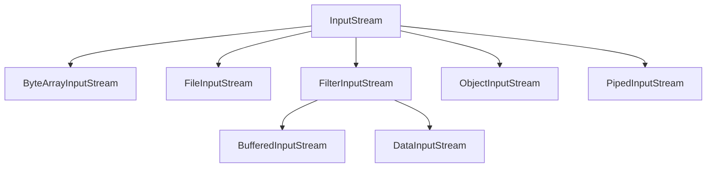
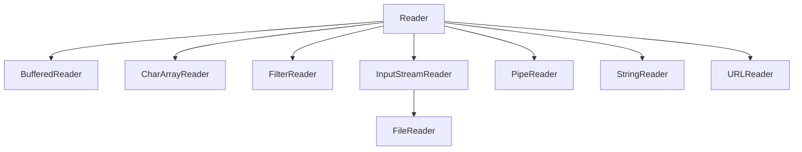
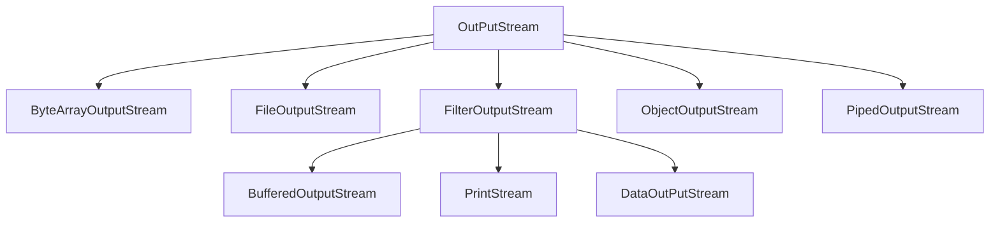
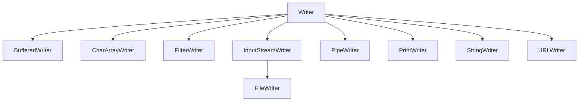
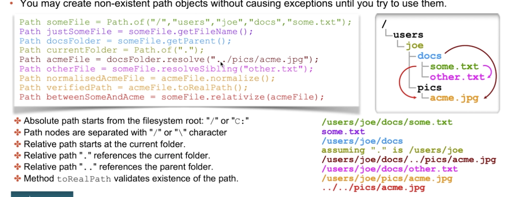
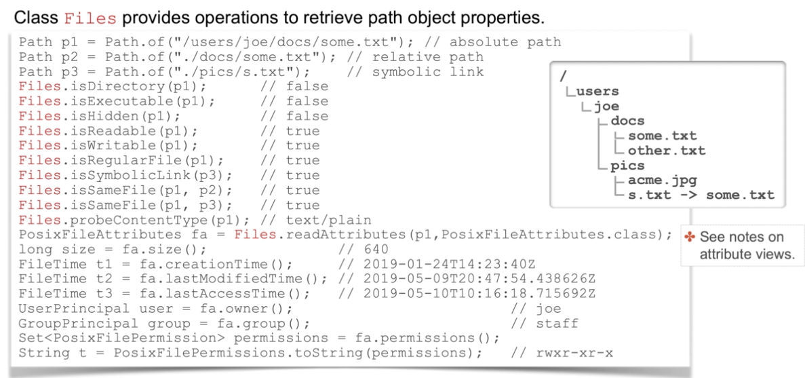

# Java IO API

- Read
    - Binary: 
        - InputStream (abstract class)
        - FileInputStream
        - ObjectInputStream
    - Character: 
        - Reader (abstract class)
        - FilterReader (abstract class)
        - BufferedReader
        - InputStreamReader
        - FileReader

- Write
    - Binary:
        - OutputStream (abstract class)
        - FileOutputStream
        - ObjectOutputStream
    - Character:
        - Writer (abstract class)
        - FilterWriter (abstract class)
        - BufferedWriter
        - OutputStreamWriter
        - FileWriter
    

- InputStream
    - int read(byte[])
    - void mark(int pos) => Mark position in the stream
    - long transferTo(OutputStream) => Transfer data from input to output
    - int available()
    - void skip(int length)
    - reset()
    - close()
    - markSupported()
    - mark()
    
markSupported: For the important ones, ByteArrayInputStream and BufferedInputStream support mark, the other ones no.

- OutputStream
    - void write(byte[])
    - void flush()
    - void close()
    
- Reader
    - int read(char[])
    - void mark(int pos) => Mark position in the stream
    - long transferTo(Writer) => Transfer data from input to output
    - int available()
    - void skip(int length)
    - reset()
    - close()

- Writer
    - void write(char[])
    - void flush()
    - void close()
      
- It's possible to connect streams => new BufferedReader(new FileReader("file.txt"));

## Standard Input and OutPut (System.* or Console)
- System.in: Read data from standard input
- System.out: Write data to standard output
- System.err: Write data to standard error output
- Scanner class as utility to read from System.in

- Console
    - readLine()
    - char[] readPassword() => Safer, char[] not in heap.
    - reader()
    - writer()

## Secure and Deserealization

- Careful with the deserealization of untrusted sources
- Implementation Seriablizable
- Fields, no static, no methods
- Transient fields.
- override writeObject, ReadObject to custom serialize, ObjectOutputStreeam.PutField, and ObjectInputStream.GetField as maps.
- Use the variable SerialPersistentField as whitelist for fields to serialize
- private static final ObjectStreamField[] serialPersistentFields = {new ObjectStreamField("next", List.class)};
- Must be private static final, and have a list of fields and types.
- Oher options, Use a proxy serialization
- int serialVersionUID = 1L; => Verion of class to protect changes of a serlialized class.

## File System

Package java.nio.file.
- Class Path represents files and folders
- Files provides operations to handle path objects
- FileSystem describes available filesytem properties.
    - PathSeparator

- Old class for files was java.io.File. There are convertors from File->Path and Path->File (toPath() toFIle() )

### Path

- Inmutable object
    - isAbsoulte()
    - toAbsoultePath()
    - getFileName()
    - getParent()
    - of
    - this.resolve(other) => If the other parameter is an absolute path then this method trivially returns other. If other is an empty path then this method trivially returns this path. If the other is a relative path the method returns a concatenation of the two.
    - this.resolveSiblings(other) => Resolves the other path against this path's parent path.
    - normalize()
    - relatibilize(path) => Construct a path from one location in the file system to another location. The relativize() method requires that both path values be absolute or relative (if not throws exception)
    - Path subpath(int beginInclusive,int endNotInclusive)
    - getName(int index) => Beginning from zero.

- toRealPath() validadates that the path exists

### Files
Class to handle operations with path objects (check FilesU class with sample operations)
- absolute()
- createFile, createDirectory, createTempFile, createSymbolyncLink
- delete => Delete only if directory is empty
- deleteIfExists
- move 
- copy => Copy and move has properties to, replace, copy properties, undo if fails.
- streams => list, walk, lines, find
- walk(Path) walk(Path, int maxDepth)
- String readString, List<String> readAllLines
- writeString
- newBufferedStream, newOutPutStream
- Object getAttribute(Path, String) => Get a file attribute. 
- Map<String, Object> readAttributes(Path, String) => Get list of attributes
- FileAttributeView getAttributeView(Path, Class<>) => Get attribute view.
- find(Path start, int maxDepth, BiPredicate<Path,BasicFileAttributes> matcher, FileVisitOption... options)

https://www.marcobehler.com/guides/java-files

Question Notes:
- Remember Path.of() and Paths.get()
- Remember Console can not be initialized with "new Console()" only with System.console().
- Remember if System.out is used in a try-with-resources it can no be used later to print anything. (does not fail)
- Remember Writer, Reader, OutputStream, InputStream abstract classes
- Remember even if the static fields are not serialized if they are seted by any reason the static context is the same.
- Remember toRealPath() throws an Exception an must be captured. If Files operation are used inside lambdas
- Files.isSameFile first compare the Paths and later verifies that it exists and if it does not exist returns an exception.
- The second argument of the copy() command should be the location of the new file, not the folder the new file is placed in.
- Is possible to concatenate streams of the same type Writers with Writers, Readers with Readers, InputStreams with InputStreams and OutPutStreams with OutPutStreams.
- If System.err is closed by a try-with-resources there could not be any System.err again and if a Exception is thrown nothing is printed.
- Instead of using Files.getAttribute or Files.readAttributes, using Files.getAttributeView cost fewer trips (as individual doing them) and supports file system dependant attributes.
- The valid way to iterate over all elements of a file using ObjectInputStream is to continue to call readObject() until an EOFException is thrown.
- Copy, move options,
    - REPLACE_EXISTING
    - COPY_ATTRIBUTES
    - NOFOLLOW_LINKS
    - ATOMIC_MOVE (only move)
- Exceptions copy, move, delete.
- AtomicMoveNotSupportedException: Atomic file operation ends in a initial state or final state but not possible in a intermediate corrupt state. This exceptions is throw if the system does no suport atomic move.
- DirectoryNotEmptyException: Can occurs with delete(), move(), copy().
- FileAlreadyExistsException: Can occurs with move(), copy() is possible to avoid only when the REPLACE_EXISTING option is not passed    
- The readPassword() returns a char array for security reasons. If the data was stored as a String, it would enter the shared JVM string pool, potentially allowing a malicious user to access it, especially if there is a memory dump. By using a char array, the data can be immediately cleared after it is written and removed from memory.
- InputStream
- reset, reset to the start to the stream or the last mark.
- mark, there are some kind of streams that supports create a mark. A mark can help when reading a stream, or reseting the stream.