# Modules

Closely related set of packages, described in the module-info.java in the root of the project.

- Globally unique name, using the format of reverse dns domains convention.
- Circular dependencies are not allowed
- Dependencies between modules can be verified at application startup.
- Classes modularized are loaded in the module-path not in classpath.
- Enables smaller application footprint.
- Defines:
  - Required module dependencies.
  - Packages that this modules exports, making them available to other module.
  - Permissions to open content to other modules.
  - Define the services that this module offer to other module
  - Service this module consume
  - Module does not allow splitting java packages.
  
### Modules Types

- System Modules – These are the modules listed when we run the list-modules command above. They include the Java SE and JDK modules.
- Application Modules – These modules are what we usually want to build when we decide to use Modules. They are named and defined in the compiled module-info.class file included in the assembled JAR.
- Automatic Modules – We can include unofficial modules by adding existing JAR files to the module path. The name of the module will be derived from the name of the JAR. Automatic modules will have full read access to every other module loaded by the path.
  - Naming of automatic modules: The rules for determining the name include removing the extension, removing numbers, and changing special characters to periods (.)

Can be added as requires to other module using jar file or adding param to Manifest.

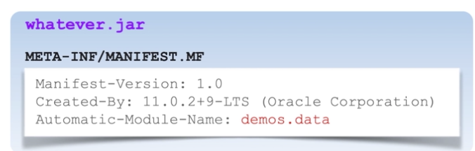

- Unnamed Module – When a class or JAR is loaded onto the classpath, but not the module path, it's automatically added to the unnamed module. It's a catch-all module to maintain backward compatibility with previously-written Java code.

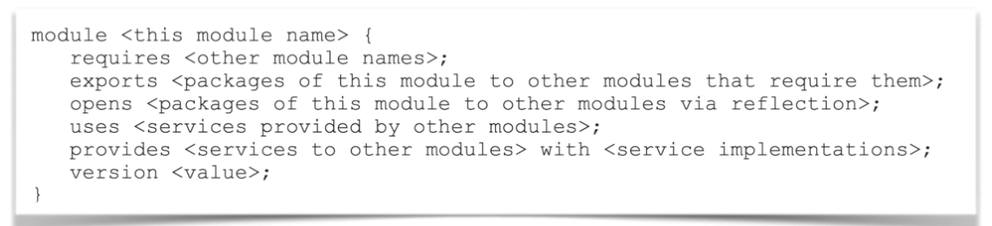

### JPMS Module Categories

Java SE Modules - java.*
- Core Jva platform general purpose APIs.
- java.base, java.se, java.logging.

JDK Modules - jdk.*
- Additional implementation-specific modules
- jdk.httoserver, jdk,console, jdk.shell

```
java --list-modules 
```

### Define Dependencies

Defines module dependencies.

```java 
module com.some {
  requires java.logging, java.logging;
  requires transitive org.acme
  requires static com.foo;
}
```

- requires <modules>: Specify a normal module dependency.
- requires transitive <modules>: Makes dependant modules available to other modules without having to declare explicit. Any module that uses "com.some" witll also use "org.acme" without having to declare it.
- requires static <modules>: Specify a dependency at compile time only.

All the modules implied requires java.base.

### Export Module Content

Export a package means making all of its public types (and their nested public and protected) available to other modules.

```java 
module demos {
  exports demos.a;
  exports demos.b to other;
}
```

- exports <packages>: Defines the packages whose are public types accesible to all other modules.
- exports <packages> to <other modules>: Restrict the exported packages to a list of specific modules.

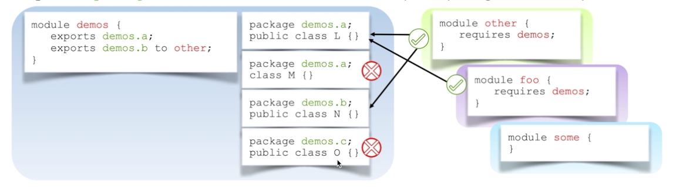

### Open Module Content

Module may allow **runtime-only** access to a package.

```java 
module demos {
  opens demos.a;
  opens demos.b to other;
}
```

- opens <packages>: Specifies package whose entire content is accessible to all other modules at runtime.
- open <packages> to <other module>: Restrict opened package to a list of specific modules.

- Opens works similar to export but also makes all non-public types available via reflection.
- Modules that contains injectable code should use opens directive as they work using reflection.

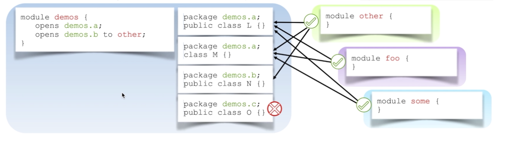


It's possible to open a entire module. Similar to classes in classpath.

```java 
open module demos {}
```

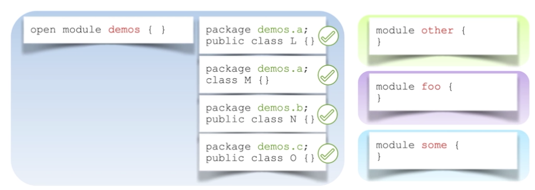

### Produce and Consume services

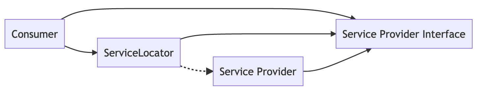

<details>
  <summary>Mermaid Format</summary>
graph LR
A[Consumer] --> C[ServiceLocator]
B[Consumer] --> C[ServiceLocator]
C[ServiceLocator] --> D[Service Provider Interface]
C[ServiceLocator] --> E[Service Provider Interface]
D[Service Provider Interface] --> F[Service Provider]
E[Service Provider Interface] --> G[Service Provider]
</details>

Modules can produce and consume services. Services comprises an interface or abstract class and one or more implementations.

- provides <service interface> with <classes>: Directive to specify that the module provides one or more service implementations that can be dynamically discovered by a consumer.
- uses <service interface>: Directive specifies an interface or abstract class that defines a service that this module needs to consume.

If there is more than one provider, it can be defined the name of the provider with the implementation.

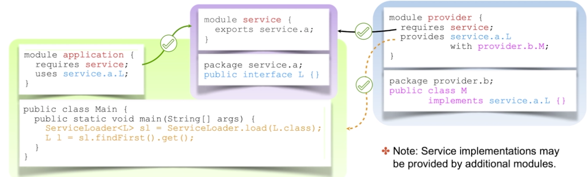

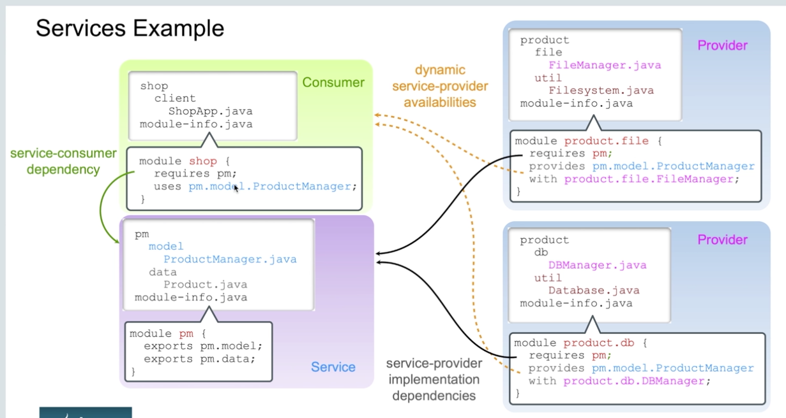


#### ServiceLoader
The service loader has the method load(Class.class) do not return Exception.
- static ServiceLoader load(Class.class)
- Optional findFirst()
- stream()  => All stream available methods
- iterate()
- reload()

### Multi-release module

- Only one copy of a module can be placed into the module path.
- Multi-release jar can be used to support different versions of code for java

- Module root directory can contain the default version or a non-modularized version of the code (for java prior to java 9)
- Specific version of code may be provided for each java version.
- Versioned descriptors (module-info) are optional but must be identical to the root descriptor. with two exceptions
  - Can have different transitive dependencies
  - Can have different use clauses.

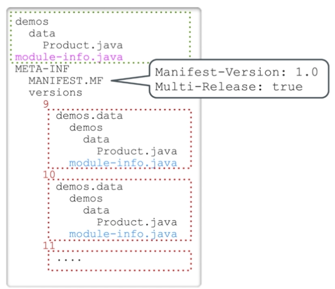

### Run Compile and Package a Module

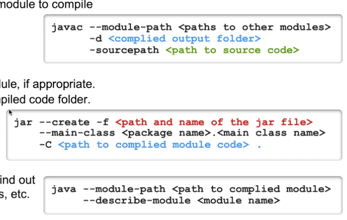


**Options to run java**

```
--add-opens module/package=target-module(,target-module)*
```

```
--add-exports <source-module>/<package>=<target-module>(,<target-module>)*
```
The --add-exports command-line option should only be used if deemed absolutely necessary. It is not advisable to use this option except for short-term solutions. The danger of using it routinely is that any updates to referenced Internal APIs could result in your code not working properly.


### JDEPS

JDeps is a dependency analysis tool for Java bytecode, i.e. class files and JARs

```
jdeps gdx-setup_latest.jar 
gdx-setup_latest.jar -> java.base
gdx-setup_latest.jar -> java.desktop
gdx-setup_latest.jar -> java.xml
   com.badlogic.gdx.setup                             -> java.awt                                           java.desktop
   com.badlogic.gdx.setup                             -> java.awt.event                                     java.desktop
   com.badlogic.gdx.setup                             -> java.awt.image                                     java.desktop
   com.badlogic.gdx.setup                             -> java.io                                            java.base
   com.badlogic.gdx.setup                             -> java.lang                                          java.base
   com.badlogic.gdx.setup                             -> java.net                                           java.base
   com.badlogic.gdx.setup                             -> javax.xml.parsers                                  java.xml
   com.badlogic.gdx.setup                             -> org.w3c.dom                                        java.xml
   com.badlogic.gdx.setup                             -> org.xml.sax                                        java.xml


jdeps -s gdx-setup_latest.jar 
gdx-setup_latest.jar -> java.base
gdx-setup_latest.jar -> java.desktop
gdx-setup_latest.jar -> java.xml


jdeps -profile gdx-setup_latest.jar 
gdx-setup_latest.jar -> java.base (compact1)
gdx-setup_latest.jar -> java.desktop (java.desktop)
gdx-setup_latest.jar -> java.xml (compact2)
   com.badlogic.gdx.setup                             -> java.awt                                           
   com.badlogic.gdx.setup                             -> java.awt.event                                     
   com.badlogic.gdx.setup                             -> java.awt.image                                     
   com.badlogic.gdx.setup                             -> java.io                                            compact1
   com.badlogic.gdx.setup                             -> java.lang                                          compact1
   com.badlogic.gdx.setup                             -> java.net                                           compact1
   com.badlogic.gdx.setup                             -> java.util                                          compact1
   com.badlogic.gdx.setup                             -> java.util.regex                                    compact1                                   
   com.badlogic.gdx.setup                             -> javax.xml.parsers                                  compact2
   com.badlogic.gdx.setup                             -> org.w3c.dom                                        compact2
   com.badlogic.gdx.setup                             -> org.xml.sax                                        compact2
```


### Create custom runtime image (jlink)

Use jlink utility to create runtime image, that contains the JDK and the application modules.

*Requires the use of modules.

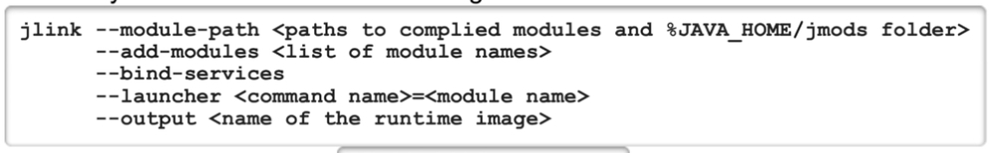

- Optimized for space and speed
- Enables faster search class loading compared to traditional classpaths jars.
- Setting launcher can create an executable application.

### Other Links

https://www.baeldung.com/java-9-modularity
https://www.baeldung.com/jlink


Question Notes:
- Identify the components of a module, service, consumer, architecture.
  - Consumer
  - Service locator
  - Service provider
  - Service provider interface
- Identify the difference between:
  - Automatic modules
  - Unnamed modules
  - Named modules
  - System modules
- Command line options to add module conf. (--add-exports --add-opens)
- Service Locator (ServiceLoader) has a load() method
- A service is comprised of the interface, and a way to look up implementations of the interface. (Service => ServiceLocator + Service provider interface)
- The consumer is generally separate so no join with other modules is possible.The service provider is decoupled from the service provider interface. It is most logical to combine the service locator and service provider interface because neither has a direct reference to the service provider.
- "use" and "provides" needs a "requires" first.
- Remember to learn options to compile and run modules.
  - compile
    - --module-path <paths to other modules>
    - -d <compiled output folder>
    - sourcepath <path to source code>
  - run
    - -p <path to modules>
    - -m \<module name>/\<package name>.\<main class name> \<arguments>
  - migrations to module:
    - top‐down migration:
      - The first step is to move all the modules to the module path.
      - Most steps consist of changing an automatic module to a named module.

