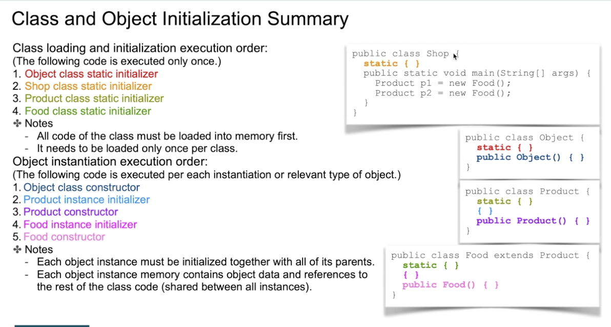
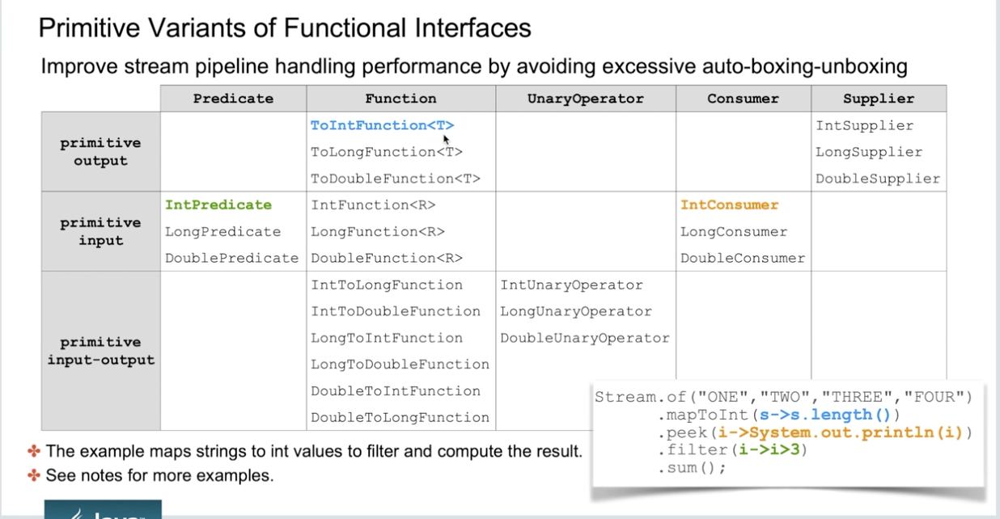
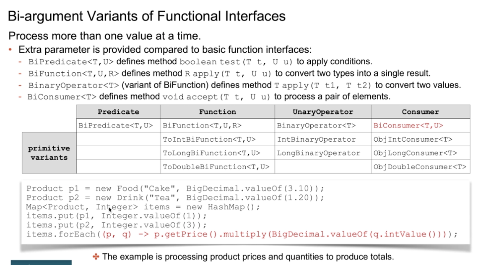

# Classes

- Model business problems using classes
    - Class Model
    - Sequence Model
- Define instance methods and variables
    - Params, return, throws Exception
- Describe the "this" object reference
- Object instantiation
- Local variables and, var inference
    - Use for local variables, for indexes, or for-each. (no fields, or params)
- Explain static variables and methods.
    - Static context, (static variable can be accessed in static method)
    - Access static variables.
    - Static block.
    - Instance variables and method not accessible in the static methods
    - static final, constant global variables.
    - import static Math.random;
- invoke methods and access variables
- Keyword final

- Method overloading: Same method with different params.
- Use of three dots ... as any number of params and works as an array.
- Create constructors
    - Default empty constructor when there is no other constructor.
    - Reuse constructor with this()
- Access  modifiers
    - public: Visible to any other class
    - protected: Visible to classes on same package and subclasses
    - <default>: Visible to classes on same package
    - private: Visible within same class
- Encapsulation
- Immutability: Class that can not be modified after creation.
    - No setters methods
    - There are thread-safe, no overhead.
    - Can be used with "final" variables.
- Instance block: Execute before the constructors
- Enumerations
    - Define public, static, final objects.
- Complex enumerators
    - Configure a specific constructor maybe private. (some field)
- Parameter passing
- Memory allocation and cleanups
    - Stack is a memory context of threads, storing local method variables.
        - Contains primitives, and object "references".
    - Heap is a shared memory area, accessible from different methods
        - Classes and object on heap
    - Cleanup
        - Local variables are cleaned at the end of block
        - Objects in the heap that have references in diffrent stacks (threads)
        - Garbage collector is not immediate, (when is needed)

# Inheritance
-  Extend classes
    -  Always extends from Object
    -  Reuse parent class code through Inheritance
- Object class: toString, equals, hashCode, cline, wait, notify, notifyAll
    - Normal to override toString, equals
    - Hascode returns a int value for instance value, it can be used for HashSets, HashMaps. Objects.hash(Object[])
-  instanceof operator
    -  Verify the class type compatible with your class.
    -  Works with parent classes "child instanceof Parent" => true
    -  Works also with: Parent p = new Child(); "p instanceof Child" => true "p instanceof Parent" => true
-  Super object reference, (difference "this" or "supper")
    -  super to refer to methods or fields.
    -  super to use as constructors.
-  Subclass constructors
    -  Must implement super constructors if there is one super.constructor with params. (and there is no default one)
-  Order of initialization
   
-  Override superclass method
-  Polymorphism
    -  Instantiate the way Parent o = new Child();
    -  Casting:
        -  It's possible between parent and child classes not between simblings.
        -  No casting required to assign a child object to a parent. (only the methods of parent available)
        -  CastingClassException
        -  Override methods
        -  Reuse logic of superclass
-  abstract classes and methods
    -  Abstract classes can not be instantiated
    -  Abstract classes defines not implemented methods, and subclassess must implement them
-  final
    -  on classess: can not be extended
    -  on methods: can not be overridden
    -  on fields: make fields constants
-  Compare Strings:
    -  String one = "Hello"; String two = "Hello"; one == two => true.
    -  String one = new String("Hello"); String two = "Hello"; one == two => false.
    -  Compare always with equals
    -  Strings are interned objects; a single copy of a String literal is stored in the pool memory area.
    -  Patterns:
        - Builder
        - Factory
        - Composition: Delegate the function implementation to other classes.

# Interfaces
- interface
    - by default all methods are public and abstract
    - by default all fields are public static final
    - constants
    - abstract methods ()
    - private methods (only visible for the interface)
    - static methods: (not is not inherited to the class!)
    - default method (can cause conflicts)
- Implement interface
    - A class must implement all the abstract methods
    - If there is a conflict between two default methods in two interfaces, the class must implement the method.
    - Interface can extend other interfaces.
- Interface as type
    - IOne ione = new ImplementOne(); => ione instanceof IOne
- Use common used Interfaces.
    - Comparable: Compare one object with the actual one.
        - class One implements Comparable<> {} compareTo(T o)
    - Comparator:
        - class One implements Comparable<> {} compare(T one, T two)
    - Cloneable: Does not have any abstract methods
        - A type class to be able to check implements clone() as type marker. (if not clone() method of object throws an Exception)

- Functional interface
    - Interface with a sinlge abstract method
    - Used for lambda operator

## Generics
    - Flavor to write classes to avoid hard-coding.(wrapper to a list of values)
    - It can be used to class level or method level generics.
        - class One<T> {}
        - public <G> void method(G[] o) {}
    - Bounded generics
        - List<T extends Number> Downguard wildcard (Number, Double, Integer) (from Number to any subclass)
        - List<? super Integer> Upguard wildcard (Integer => Number => Object) (from Integer to up)
        - List<T extends Number & Comparable> Multiple Bounds
    - Wildcards
        - List<?> anything; => Wildcard with any value
        - WildCard subtyping:
            - List<Parent> list = new ArrayList<Child>(); => Compilation Error
            - List<? extends Parent> list = new ArrayList<Child>(); => Works
    - Generics Erasure: The process that the compiler does to convert the generics types to real objects.
    - super only on wildcards  List<? super Integer>

https://www.baeldung.com/java-generics
https://docs.oracle.com/javase/tutorial/java/generics/index.html

## Nested Classes
- Static nested class:
    - Inner class can access static context of outer class.
    - Can access static (including private) variables and method from outer class
    - Can be created making reference to the outer class.
        - InnerStatic innerStatic = new Outer.InnerStatic();
- Member inner class:
    - Inner class can access instance context of outer class.
    - Can access instance and static (including private) variables and method from outer class
    - Can be created making referece to the outer class.
        - InnerMember innerMember = new Outer().new InnerMember();
- Local inner class:
    - Inner class created inside a method (only visible inside method)
    - Class can see outer fields, and variables but they must be final or effectively final.
- Anonymous inner classes:
    - Inline implementation of interface or abstract class.
    - Class can see outer fields, and variables but they must be final or effectively final.
    - They can be public, protected or default. if they are private the nested can only be accessed from the outer class.

## Lambdas
- Inline implementation of functional interfaces
- Functional Interfaces, interface with single abstract method.
- (list of params) -> implementation
- Method references using ::
    - Class::staticMethod
    - Object::instanceMethod
    - Class:::instanceMethod
    - Class::new
- If the interface has defaults methods, they can be called.
- Common types of of functional interfaces:
    -  **Functions:** Functional interface with a method that receives one value and returns another.
        - Abstract method, R apply(T t)
        - Default methods, andThen compose.
        - Static method, identity (returns a Function that returns the same input)
        -  Since a primitive type can’t be a generic type argument, there are versions of the Function interface for the most used primitive types double, int, long, and their combinations in argument and return types:
        - IntFunction, LongFunction, DoubleFunction: arguments are of specified type, return type is parameterized
        - ToIntFunction, ToLongFunction, ToDoubleFunction: return type is of specified type, arguments are parameterized
        - DoubleToIntFunction, DoubleToLongFunction, IntToDoubleFunction, IntToLongFunction, LongToIntFunction, LongToDoubleFunction: having both argument and return type defined as primitive types, as specified by their names
        - Two-Arity Function Specializations: Define lambdas with two arguments,there are interfaces that contain “Bi” keyword in their names: BiFunction, ToDoubleBiFunction, ToIntBiFunction, and ToLongBiFunction.
    - **Supliers:** The Supplier functional interface receive no arguments and returns something.
        - There are specialization of Suplier with BooleanSupplier, DoubleSupplier, LongSupplier and IntSupplier
        - Abstract method, T get();
- **Consumers:** As opposed to the Supplier, the Consumer accepts a generified argument and returns nothing.
    - Abstract method, void accept(T t)
    - Default method andThen to concatenate to other consumer consumer.andThen(otherConsumer)
    - Another set of specialized BiConsumer versions is comprised of ObjDoubleConsumer, ObjIntConsumer, and ObjLongConsumer,
- **Predicates:** In mathematical logic, a predicate is a function that receives a value and returns a boolean value.
    - Abstract method, void test(T t)
    - Default methods, and, or, negate
    - Static methods, not and isEqual.
    - As in all of the previous examples, there are IntPredicate, DoublePredicate and LongPredicate versions of this function that receive primitive values.
- **Operator:** Operator interfaces are special cases of a function that receive and return the same value type.
- **Runnable:** Can create a Thread object using a lambda expression.
- **Comparator, Comparable**

https://docs.oracle.com/javase/8/docs/api/java/util/function/package-summary.html
https://www.baeldung.com/java-8-functional-interfaces#Functions

