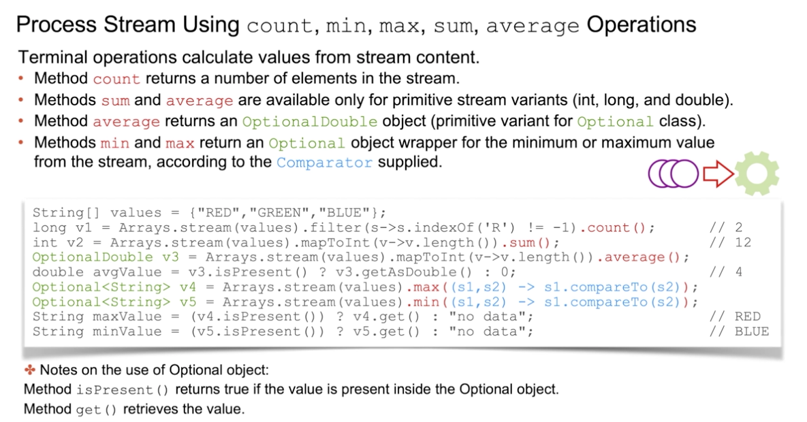
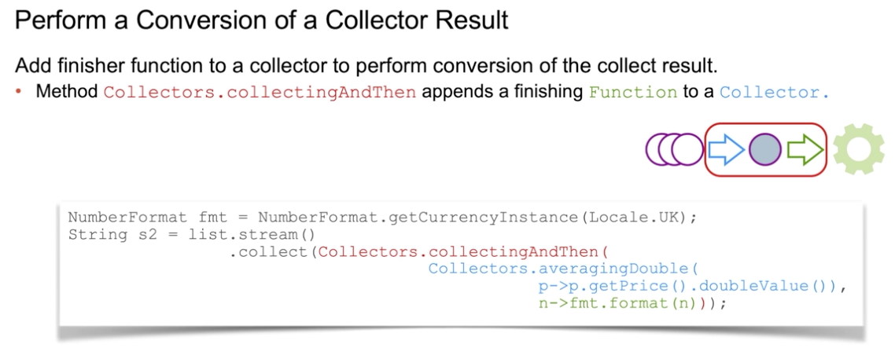

# Streams
Inmutable flow of elements, that can be procesed sequentally or in parallel.
- BaseStream: Defines core behaviors
- Stream, DOubleStream, IntStream interfaces that extends baseStream.

- Create Streams
  IntStream.generate().takeWhile().sum()
  Stream.of().foreach()
  list.stream().parallel().mapToDouble().sum();
  Arrays.stream(array).filter().forEach();

|Intermediate   |Terminal   | 
|---|---|
|filter   | forEach  |
|map   | forEachOrdered |
|flatMap   | count  |
|peek   | min  |
|distinct   | max  |
|sorted   | sum  |
|dropWhile   | average  |
|skip   |collect   |
|limit *  | reduce  |
|takeWhile *   | allMatch * |
|   | anyMatch * |
|   | noneMatch * |
|   | findAny * |
|   | findFirst * |

* Short circuit , produce finite results even the stream is infinite.

Stream.generate(<Suplier>)
.filter(<Predicate>)
.peek(<Consumer>)
.map(<Function>/<UnaryOperator>)
.forEach(<Consumer>);

- Diference between forEach and forEachOrdered, forEach does not guarente respecting order.
- peek does samething that forEach but forEach is terminal.
- map():
    - Accepts a Function<T,R> or UnaryOperator<T>
    - Variants, mapToInt, mapToLong, mapToDouble
- flatMap(): (build a single stream of a list of list). Combine streams, to sinlge stream.

Parallel()
- Elements of stream are divied in subsets.
- Subsets are procesed in parallel. (Subsets can de divied into further subsets)
- Subsets then are combined.
- Entire stream processing will turn parallel/sequential depending wich one is called last.

list.stream().parallel().mapToDouble(p -> p.getValue()).sum()

 - When to parallelize
    - Stateless:One element must not be dependant of other
    - Non-interfering: Data source must not be affected (add or remove data)
    - Associate: Results must no be affected by the order of operands

Restriction on Parallel Stream

- Do not perform a sequential operator (System.out.println is a sequetial process)
    list.stream.parallel().peek(p -> System.out.println(p))...
- Do not permform operations that modify a shared resource.
  list.stream.parallel().foreach(p -> p.addPrice())
- In Collectors do not use .toMap use toConcurrentMap instedad. (Collectos.tolist() is ok) 

https://www.baeldung.com/java-8-collectors
https://www.baeldung.com/java-groupingby-collector
https://www.baeldung.com/java9-stream-collectors
